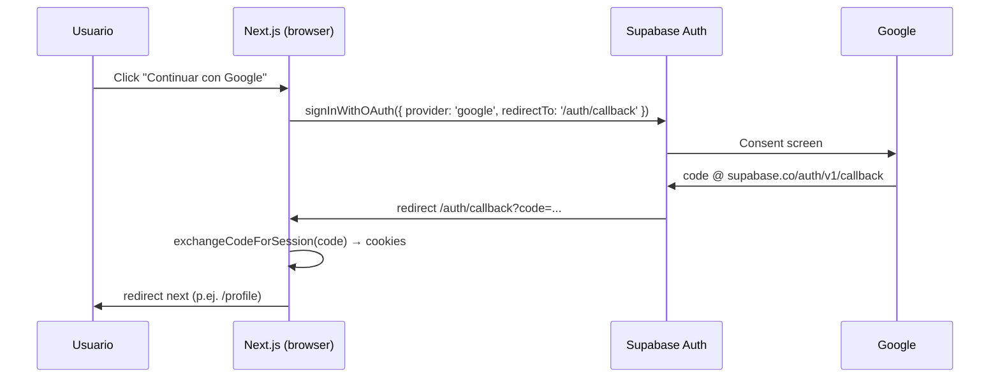

# Investigación: Supabase Auth en Next.js 15 App Router (React 19)

> Fecha: 2026-07-11  
> Contexto: `chapas-racing` — hot-seat en `/` sin login; rutas futuras online/editores protegidas; perfil en Postgres con RLS.  
> Fuentes: [Supabase Server-Side Auth](https://supabase.com/docs/guides/auth/server-side/creating-a-client), [@supabase/ssr](https://github.com/supabase/ssr), [Login with Google](https://supabase.com/docs/guides/auth/social-login/auth-google), [User Management Quickstart](https://supabase.com/docs/guides/getting-started/tutorials/with-nextjs).

---

## Resumen ejecutivo

**Patrón recomendado (2025–2026):** `@supabase/ssr` + `@supabase/supabase-js`, sesión en **cookies httpOnly** vía PKCE, **middleware** que refresca tokens con `getUser()` y **protege solo prefijos concretos** (no `/`). Tres factories de cliente: browser, server (RSC/route handlers), middleware.

**Encaje con chapas-racing:** La home (`src/app/page.tsx`) es `"use client"` + Canvas WASM; auth no debe tocarla. Infra auth vive en `src/lib/supabase/` + `middleware.ts` + rutas nuevas bajo grupos protegidos. Perfil en `public.profiles` con trigger en `auth.users`; RLS estricta; avatar opcional en Storage.

**Bloqueo repo:** F02 requiere aprobación explícita de deps (`@supabase/supabase-js`, `@supabase/ssr`) — regla “cero deps nuevas”.

---

## 1. Paquetes mínimos y setup App Router

### Paquetes

| Paquete | Rol | ¿Obligatorio? |
|---------|-----|---------------|
| `@supabase/supabase-js` | Cliente core (Auth, PostgREST, Storage) | **Sí** — peer de `@supabase/ssr` |
| `@supabase/ssr` | `createBrowserClient`, `createServerClient`, cookie bridging PKCE | **Sí** para App Router SSR |

**No usar** el paquete legacy `@supabase/auth-helpers-nextjs` (deprecado; migrar a `@supabase/ssr`).

Instalación (tras aprobación usuario):

```bash
pnpm add @supabase/supabase-js @supabase/ssr
```

### Variables de entorno

```env
NEXT_PUBLIC_SUPABASE_URL=https://<project-ref>.supabase.co
NEXT_PUBLIC_SUPABASE_ANON_KEY=<anon-key>
# Docs recientes también usan NEXT_PUBLIC_SUPABASE_PUBLISHABLE_KEY — mismo valor que anon key
```

Opcional local: `SUPABASE_SERVICE_ROLE_KEY` solo en scripts/migraciones server-side, **nunca** en cliente ni `NEXT_PUBLIC_*`.

### Estructura de archivos propuesta

```
src/lib/supabase/
  client.ts       # createBrowserClient — componentes "use client"
  server.ts       # createServerClient — RSC, Server Actions, route handlers
  middleware.ts   # updateSession(request) — helper reutilizable
middleware.ts     # raíz: refresh + guard de rutas protegidas
src/app/
  login/page.tsx
  auth/
    callback/route.ts      # exchangeCodeForSession (PKCE)
    auth-code-error/page.tsx
  (protected)/            # route group — layout con guard server
    online/...
    editor/...
  profile/page.tsx        # editable; puede vivir en (protected) o con guard propio
src/types/
  supabase.ts             # generado: supabase gen types typescript
supabase/
  migrations/
    20260711_profiles.sql
```

Convenciones repo: alias `@/`, exports nombrados, `"use client"` solo donde haga falta.

### Tres factories (patrón oficial)

**Browser** (`src/lib/supabase/client.ts`):

```ts
import { createBrowserClient } from "@supabase/ssr";

export function createClient() {
  return createBrowserClient(
    process.env.NEXT_PUBLIC_SUPABASE_URL!,
    process.env.NEXT_PUBLIC_SUPABASE_ANON_KEY!,
  );
}
```

**Server** (`src/lib/supabase/server.ts`) — Next 15: `cookies()` es async:

```ts
import { createServerClient } from "@supabase/ssr";
import { cookies } from "next/headers";

export async function createClient() {
  const cookieStore = await cookies();
  return createServerClient(
    process.env.NEXT_PUBLIC_SUPABASE_URL!,
    process.env.NEXT_PUBLIC_SUPABASE_ANON_KEY!,
    {
      cookies: {
        getAll() {
          return cookieStore.getAll();
        },
        setAll(cookiesToSet) {
          try {
            cookiesToSet.forEach(({ name, value, options }) =>
              cookieStore.set(name, value, options),
            );
          } catch {
            // setAll desde Server Component — ignorar si middleware ya refrescó
          }
        },
      },
    },
  );
}
```

**Crítico:** `createServerClient` en middleware **debe** implementar `getAll` **y** `setAll`. Sin `setAll` → logouts aleatorios y refresh roto (warning oficial `@supabase/ssr`).

---

## 2. Sesión persistente: cookies + middleware

### Modelo de sesión

- Flujo **PKCE** (no implicit) para SSR: tokens en cookies, no `localStorage`.
- Middleware ejecuta `supabase.auth.getUser()` en cada request del matcher — valida JWT en servidor Auth (preferido sobre `getSession()` solo en memoria).
- `setAll` escribe cookies refrescadas en la `NextResponse` devuelta.

### Helper `updateSession` (patrón Supabase)

```ts
// src/lib/supabase/middleware.ts
import { createServerClient } from "@supabase/ssr";
import { NextResponse, type NextRequest } from "next/server";

export async function updateSession(request: NextRequest) {
  let supabaseResponse = NextResponse.next({ request });

  const supabase = createServerClient(
    process.env.NEXT_PUBLIC_SUPABASE_URL!,
    process.env.NEXT_PUBLIC_SUPABASE_ANON_KEY!,
    {
      cookies: {
        getAll() {
          return request.cookies.getAll();
        },
        setAll(cookiesToSet, headers) {
          cookiesToSet.forEach(({ name, value }) =>
            request.cookies.set(name, value),
          );
          supabaseResponse = NextResponse.next({ request });
          cookiesToSet.forEach(({ name, value, options }) =>
            supabaseResponse.cookies.set(name, value, options),
          );
          Object.entries(headers).forEach(([key, value]) =>
            supabaseResponse.headers.set(key, value),
          );
        },
      },
    },
  );

  // IMPORTANTE: no código entre createServerClient y getUser()
  const {
    data: { user },
  } = await supabase.auth.getUser();

  return { supabaseResponse, user };
}
```

### Middleware raíz — refresh + protección selectiva

```ts
// middleware.ts
import { type NextRequest, NextResponse } from "next/server";
import { updateSession } from "@/lib/supabase/middleware";

const PROTECTED_PREFIXES = ["/online", "/editor", "/profile"];

export async function middleware(request: NextRequest) {
  const { supabaseResponse, user } = await updateSession(request);
  const { pathname } = request.nextUrl;

  const isProtected = PROTECTED_PREFIXES.some((p) => pathname.startsWith(p));
  const isAuthRoute =
    pathname.startsWith("/login") || pathname.startsWith("/auth");

  if (isProtected && !user) {
    const url = request.nextUrl.clone();
    url.pathname = "/login";
    url.searchParams.set("next", pathname);
    return NextResponse.redirect(url);
  }

  if (user && pathname === "/login") {
    return NextResponse.redirect(new URL("/", request.url));
  }

  return supabaseResponse;
}

export const config = {
  matcher: [
    // Solo rutas que necesitan refresh o guard — NO obligatorio incluir "/"
    "/online/:path*",
    "/editor/:path*",
    "/profile/:path*",
    "/login",
    "/auth/:path*",
  ],
};
```

**Hot-seat (`/`):** al **excluir** `/` del `matcher`, el juego no pasa por middleware auth. Cero overhead, cero redirect. Las rutas protegidas sí refrescan sesión al entrar.

**Alternativa defensiva:** layout `(protected)/layout.tsx` con `createClient()` + `getUser()` + `redirect('/login')` como segunda capa (útil si se olvida prefijo en middleware).

**Server Actions / Route Handlers:** revalidar `getUser()` dentro de cada mutación (regla Next: actions son endpoints públicos).

---

## 3. Google OAuth + callback en Next

### Configuración Supabase Dashboard

1. Auth → Providers → Google: Client ID + Secret (Google Cloud Console, tipo **Web application**).
2. **Authorized redirect URI** en Google: `https://<project-ref>.supabase.co/auth/v1/callback` (no la URL de Next).
3. Auth → URL Configuration:
   - Site URL: `http://localhost:3000` (dev) / producción
   - Redirect URLs allow list: `http://localhost:3000/auth/callback`, `https://<dominio>/auth/callback`

### Flujo PKCE (recomendado SSR)



### Cliente — iniciar OAuth

```ts
// En componente "use client" (p.ej. LoginForm)
const supabase = createClient();
await supabase.auth.signInWithOAuth({
  provider: "google",
  options: {
    redirectTo: `${window.location.origin}/auth/callback`,
    queryParams: { prompt: "select_account" },
  },
});
```

Email/password (F02-B): `signInWithPassword` / `signUp` en el mismo formulario; sin callback route (sesión directa en cookies vía cliente SSR-aware).

### Callback route (oficial Next.js)

`src/app/auth/callback/route.ts`:

```ts
import { NextResponse } from "next/server";
import { createClient } from "@/lib/supabase/server";

export async function GET(request: Request) {
  const { searchParams, origin } = new URL(request.url);
  const code = searchParams.get("code");
  let next = searchParams.get("next") ?? "/";
  if (!next.startsWith("/")) next = "/";

  if (code) {
    const supabase = await createClient();
    const { error } = await supabase.auth.exchangeCodeForSession(code);
    if (!error) {
      const forwardedHost = request.headers.get("x-forwarded-host");
      const isLocalEnv = process.env.NODE_ENV === "development";
      if (isLocalEnv) {
        return NextResponse.redirect(`${origin}${next}`);
      }
      if (forwardedHost) {
        return NextResponse.redirect(`https://${forwardedHost}${next}`);
      }
      return NextResponse.redirect(`${origin}${next}`);
    }
  }

  return NextResponse.redirect(`${origin}/auth/auth-code-error`);
}
```

**Notas:**
- `redirectTo` en `signInWithOAuth` debe estar en allow list de Supabase.
- Google devuelve `full_name` y `avatar_url` en `raw_user_meta_data` → útil para seed del trigger `handle_new_user`.
- No guardar `provider_token` en DB (recomendación Supabase).

---

## 4. Esquema `profiles` + RLS

### Tabla adaptada a chapas-racing

```sql
-- supabase/migrations/20260711_profiles.sql

create table public.profiles (
  id uuid not null references auth.users on delete cascade primary key,
  display_name text not null default '',
  cap_color text not null default '#3b82f6',
  avatar_url text,
  updated_at timestamptz not null default now(),

  constraint display_name_length check (char_length(display_name) between 1 and 32),
  constraint cap_color_hex check (cap_color ~ '^#[0-9A-Fa-f]{6}$')
);

comment on column public.profiles.cap_color is 'Color de chapa en partidas online (hex #RRGGBB)';

alter table public.profiles enable row level security;

-- Lectura pública (lobbies, leaderboard futuro)
create policy "Profiles are viewable by everyone"
  on public.profiles for select
  using (true);

create policy "Users can insert own profile"
  on public.profiles for insert
  with check ((select auth.uid()) = id);

create policy "Users can update own profile"
  on public.profiles for update
  using ((select auth.uid()) = id)
  with check ((select auth.uid()) = id);

-- Trigger: fila al registrarse (Google meta o email)
create or replace function public.handle_new_user()
returns trigger
language plpgsql
security definer
set search_path = ''
as $$
begin
  insert into public.profiles (id, display_name, avatar_url)
  values (
    new.id,
    coalesce(
      new.raw_user_meta_data->>'full_name',
      new.raw_user_meta_data->>'name',
      split_part(new.email, '@', 1),
      'Jugador'
    ),
    new.raw_user_meta_data->>'avatar_url'
  );
  return new;
end;
$$;

create trigger on_auth_user_created
  after insert on auth.users
  for each row execute function public.handle_new_user();

-- updated_at automático
create or replace function public.set_updated_at()
returns trigger language plpgsql as $$
begin
  new.updated_at = now();
  return new;
end;
$$;

create trigger profiles_updated_at
  before update on public.profiles
  for each row execute function public.set_updated_at();
```

### Storage avatars (opcional F02-D)

```sql
insert into storage.buckets (id, name, public)
  values ('avatars', 'avatars', true)
  on conflict (id) do nothing;

create policy "Avatar images are publicly accessible"
  on storage.objects for select
  using (bucket_id = 'avatars');

create policy "Users can upload own avatar"
  on storage.objects for insert
  with check (
    bucket_id = 'avatars'
    and (storage.foldername(name))[1] = (select auth.uid())::text
  );

create policy "Users can update own avatar"
  on storage.objects for update
  using (
    bucket_id = 'avatars'
    and (storage.foldername(name))[1] = (select auth.uid())::text
  );
```

Convención path: `avatars/{userId}/avatar.webp`. Tras upload, `profiles.avatar_url` = public URL.

### Tipos TypeScript

```bash
pnpm dlx supabase gen types typescript --project-id <ref> > src/types/supabase.ts
```

Usar `Database['public']['Tables']['profiles']['Row']` en UI perfil.

---

## 5. Proteger rutas sin bloquear hot-seat

### Estado actual repo

- Única ruta de juego: `src/app/page.tsx` (`/`) — hot-seat, `"use client"`, sin auth.
- Sin `middleware.ts` ni Supabase instalado.

### Estrategia recomendada (defensa en profundidad)

| Capa | Alcance | Comportamiento |
|------|---------|----------------|
| **Middleware matcher** | `/online/*`, `/editor/*`, `/profile/*`, `/login`, `/auth/*` | Refresh cookies + redirect si no hay user en protegidas |
| **Route group `(protected)`** | Layout server de online/editor | `getUser()` → `redirect('/login?next=...')` |
| **RSC / Server Actions** | Mutaciones perfil, salas | `getUser()` obligatorio en cada action |
| **RLS Postgres** | `profiles`, Storage | Última línea de defensa |
| **`/` hot-seat** | Fuera de matcher y sin imports Supabase | Acceso anónimo total |

### Rutas futuras sugeridas

```
/                    → hot-seat (público, sin cambios)
/login               → público
/auth/callback       → público (OAuth)
/profile             → protegida (usuario logueado)
/online              → protegida (F03+)
/online/[roomId]     → protegida
/editor              → protegida (circuitos custom)
/editor/[trackId]    → protegida
```

### UX opcional en home

- Link “Iniciar sesión” / avatar en HUD **sin** exigir login para jugar.
- `createBrowserClient().auth.getUser()` solo para mostrar estado; no bloquea `SetupScreen`.

### Anti-patrones a evitar

- Matcher global `/(.*)` con redirect universal → **bloquearía** `/`.
- Guard auth dentro de `GameCanvas` / stores de partida → viola capas (`app/` = infra, no lógica de juego).
- `localStorage` para sesión → incompatible con RSC/middleware.
- `getSession()` como única verificación en servidor → no revalida JWT; usar `getUser()`.

---

## Compatibilidad Next 15 + React 19

- `cookies()` / `headers()` async en server — `await` obligatorio.
- React 19: sin `forwardRef` en wrappers nuevos; `use()` para context si aplica.
- Canvas sigue en `dynamic(..., { ssr: false })` — auth no altera este boundary.
- Middleware corre en Edge; solo APIs compatibles (Supabase SSR lo soporta).

---

## Sub-tareas F02-A..E (recomendación implementer)

### F02-A — Cliente Supabase + env + tipos

**Alcance:**
- Aprobación deps + `pnpm add @supabase/supabase-js @supabase/ssr`
- `.env.local.example` con vars documentadas
- `src/lib/supabase/{client,server,middleware}.ts`
- `middleware.ts` raíz (solo refresh en rutas auth/login inicialmente)
- `src/types/supabase.ts` (placeholder o generado tras proyecto Supabase)
- `pnpm tsc --noEmit && pnpm build` verde

**Criterios aceptación:**
- [ ] Tres factories compilan sin errores
- [ ] Middleware no incluye `/` en matcher
- [ ] Sin imports Supabase en `src/app/page.tsx` ni `src/core/`

**Depende de:** aprobación usuario deps + proyecto Supabase creado.

---

### F02-B — UI login (email/password + Google OAuth)

**Alcance:**
- `src/app/login/page.tsx` + componente `src/ui/LoginForm.tsx`
- Google: `signInWithOAuth` + `redirectTo` `/auth/callback`
- Email/password: `signInWithPassword`, `signUp`, mensajes error ES
- `src/app/auth/callback/route.ts` + `auth-code-error/page.tsx`
- Config Dashboard: Google provider + redirect URLs

**Criterios aceptación:**
- [ ] Google OAuth completa y redirige a `/` o `next`
- [ ] Email login funciona en local
- [ ] Usuario no logueado puede seguir jugando hot-seat en `/`
- [ ] `pnpm tsc --noEmit && pnpm build` verde

**Depende de:** F02-A.

---

### F02-C — Migración `profiles` + RLS

**Alcance:**
- `supabase/migrations/20260711_profiles.sql` (tabla + RLS + trigger + storage avatars)
- Aplicar migración en proyecto Supabase (`supabase db push` o MCP `apply_migration`)
- Regenerar `src/types/supabase.ts`
- Verificar trigger crea fila tras primer signup

**Criterios aceptación:**
- [ ] RLS enabled; anon no puede update ajeno
- [ ] `select` público devuelve perfiles
- [ ] Nuevo usuario Google/email tiene fila `profiles` automática
- [ ] `cap_color` default válido

**Depende de:** F02-A, proyecto Supabase.

---

### F02-D — UI perfil editable

**Alcance:**
- `src/app/profile/page.tsx` (protegida)
- Form: `display_name`, `cap_color` (picker), `avatar_url` opcional (upload Storage)
- Server Action o client `supabase.from('profiles').update()` con RLS
- Link desde login/HUD cuando hay sesión

**Criterios aceptación:**
- [ ] Solo usuario autenticado accede `/profile`
- [ ] Edición persiste y `updated_at` cambia
- [ ] Avatar upload opcional; sin avatar mantiene null o URL Google del trigger
- [ ] UI coherente con convenciones `src/ui/`

**Depende de:** F02-B, F02-C, F02-E (guard `/profile`).

---

### F02-E — Protección de rutas

**Alcance:**
- Completar `middleware.ts`: `PROTECTED_PREFIXES`, redirect `?next=`
- `src/app/(protected)/layout.tsx` con guard server
- Stubs `src/app/(protected)/online/page.tsx` y `editor/page.tsx` (“próximamente”) para validar guards
- Documentar en código qué rutas son públicas

**Criterios aceptación:**
- [ ] `/` hot-seat funciona sin sesión (manual: jugar partida completa)
- [ ] `/online`, `/editor`, `/profile` redirigen a `/login` sin sesión
- [ ] Tras login, `next` devuelve a ruta original
- [ ] `pnpm tsc --noEmit && pnpm build` verde

**Depende de:** F02-A, F02-B.

**Orden sugerido:** A → B + C en paralelo → E → D.

---

## Referencias

- [Creating a Supabase client (Next.js)](https://supabase.com/docs/guides/auth/server-side/creating-a-client)
- [Login with Google — Next.js callback](https://supabase.com/docs/guides/auth/social-login/auth-google)
- [Redirect URLs](https://supabase.com/docs/guides/auth/redirect-urls)
- [Row Level Security](https://supabase.com/docs/guides/database/postgres/row-level-security)
- [Managing user data (triggers)](https://supabase.com/docs/guides/auth/managing-user-data)
- [@supabase/ssr — middleware + setAll](https://github.com/supabase/ssr)

---

## Riesgos / decisiones pendientes

1. **Deps:** bloqueado hasta OK usuario (`progress/current.md`).
2. **Proyecto Supabase:** URL/keys y Google OAuth en Dashboard — setup manual.
3. **Matcher middleware:** revisar cuando se añadan API routes que necesiten sesión.
4. **Vitest:** tests puros posibles para helpers de validación perfil (`cap_color` hex) — opcional F02-D.
5. **Nombre env key:** unificar `ANON_KEY` vs `PUBLISHABLE_KEY` al implementar (mismo valor).
